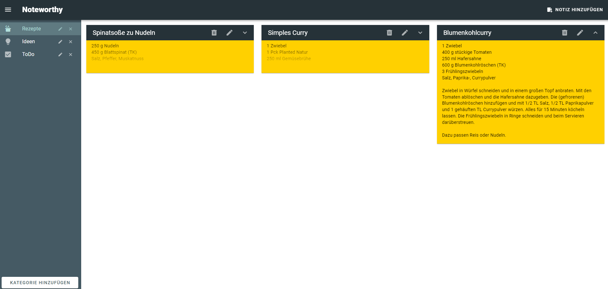
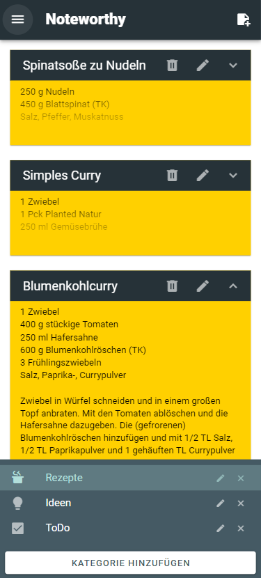

# NoteWorthy

------

## Preview
| Desktop | Smartphone |
| --- | --- |
|  |  |

## About the Project
This is my first full stack project, a note taking app primarily focused on learning the technologies used. The project is built on a multi-module Maven structure, consisting of a frontend and a backend module. The frontend is developed with Vue.js 3 and the Vuetify component framework. The backend is based on Spring Boot and utilizes a PostgreSQL database, which runs in a Docker container to avoid the need for a local PostgreSQL installation. Communication between the frontend and backend is handled using Axios. Note texts are stored in the database as CLOBs (Character Large Objects). Although this is not technically necessary, I chose to use LOBs to gain experience working with them.

------

## Technologies

* Spring Boot 3.3.2
* Docker Compose
* PostgreSQL
* Vue.JS 3
* Vuetify
* Axios
* Maven

## Features

* Create your own categories and choose appropriate icons for them. Edit or delete your categories as needed.
* Take your own notes and assign them to a category. Edit your notes, move them to another category, or delete them.
* Responsive Design: The application adapts to your screen size.
* Supported Languages: German.

------

## Install

1. Clone the repository.
2. Navigate to the project directory: `cd your-repo`.
3. Build the Maven project `mvn package`.

### Within IDE
4. Start the main class in the backend module `de.k0ju.noteworthy.NoteWorthyBackend`.
5. Open your browser and go to `http://localhost:8080/`.

### Outside IDE
4. Navigate to the backend directory: `cd your-repo/backend` and start the database: `docker-compose up`.
5. Navigate to the target directory: `cd your-repo/backend/target` and start the backend: `java -jar NoteWorthyBackend-1.0-SNAPSHOT.jar`.
6. Navigate to the frontend directory: `cd your-repo/frontend` and start the frontend: `npm run serve`.
7. Open your browser and go to `http://localhost:8080/`.